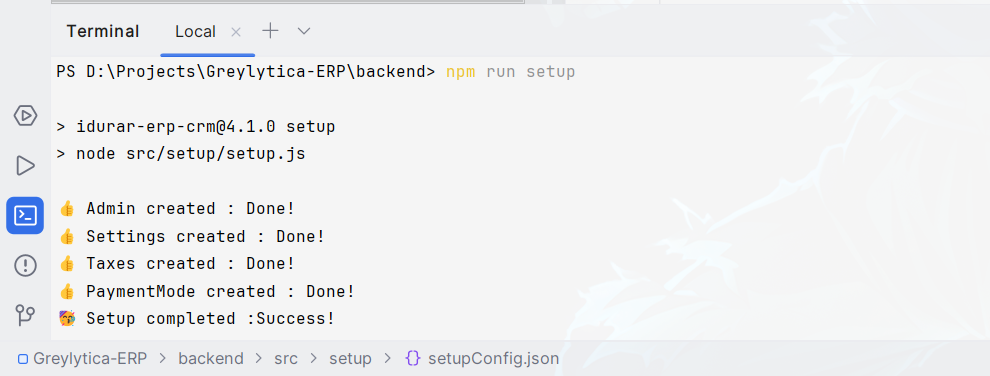

## Getting started

#### Step 1: Clone the repository

```bash
git clone https://github.com/Aggre7/greylytica.git
```

```bash
cd greylytica
```

#### Step 2: Create Your MongoDB Account and Database Cluster

- To establish a MongoDB account, navigate to the MongoDB website and complete the registration process.

- Consult the MongoDB documentation to create a new database or cluster.  Be sure to record the "Connect to your application URI" (replacing `<password>` with your actual password) for later use.

- For connection authorization, ensure your current IP address is included in the MongoDB database's IP whitelist. This update is required whenever your IP address changes.

#### Step 3: Edit the Environment File

- The .env file in the /backend directory holds the project's environment variables.

#### Step 4: Update MongoDB URI

In the .env file, find the line that reads:

`DATABASE="your-mongodb-uri"`

Replace "your-mongodb-uri" with the actual URI of your MongoDB database.

#### Step 5: Install Backend Dependencies

In your terminal, navigate to the /backend directory

```bash
cd backend
```

then churn the following command to install the backend dependencies:

```bash
npm install
```

This command installs all necessary packages listed in `package.json`

#### Step 6: Run Setup Script

While still in the /backend directory of the project, execute the following command to run the setup script:

```bash
npm run setup
```


This setup script may perform necessary database migrations or any other initialization tasks required for the project.

#### Step 7: Run the Backend Server

Start the backend server by running the following command in the same terminal.

```bash
npm run dev
```

This command will start the backend server, and it will listen for incoming requests.

#### Step 8: Install Frontend Dependencies

Open a new terminal window , and run the following command to install the frontend dependencies:

```bash
cd frontend
```

```bash
npm install
```

#### Step 9: Run the Frontend Server

After installing the frontend dependencies, run the following command in the same terminal to start the frontend server:

```bash
npm run dev
```

This command starts the frontend server, accessible at localhost:3000 in your browser.

:exclamation: :warning:` If you encounter an OpenSSL error while running the frontend server, follow these additional steps:`

Reason behind error: This is caused by the node.js V17 compatible issues with OpenSSL, see [this](https://github.com/nodejs/node/issues/40547) and [this](https://github.com/webpack/webpack/issues/14532) issue on GitHub.


Try one of these and error will be solved

- > upgrade to Node.js v20.

- > Enable legacy OpenSSL provider

Here is how you can enable legacy OpenSSL provider

- On Unix-like (Linux, macOS, Git bash, etc.)

```bash
export NODE_OPTIONS=--openssl-legacy-provider
```

- On Windows command prompt:

```bash
set NODE_OPTIONS=--openssl-legacy-provider
```

- On PowerShell:

```bash
$env:NODE_OPTIONS = "--openssl-legacy-provider"
```

Here is [reference](https://github.com/webpack/webpack/issues/14532#issuecomment-947012063) about enabling legacy OpenSSL provider

After trying above solutions, run below command

```bash
npm run dev
```

> If you still facing issue, then follow [this stackoverflow thread](https://stackoverflow.com/questions/69692842/error-message-error0308010cdigital-envelope-routinesunsupported). It has so many different types of opinions. You definitely have solution after going through the thread.