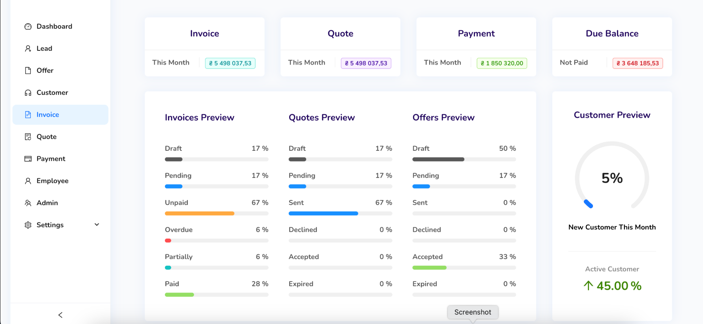

<div align="center">
    <a href="">
  
    </a>
    <h1>Open Source ERP</h1>
    <p align="center">
        <p>Greylytica ERP | Streamline Your Business Operations, One Click at a Time, with Powerful ERP.</p>
    </p>


```
 Give a Star ⭐️ & Fork to this project ... Happy coding! 🤩`
```

GREYLYTICA is Open Source ERP / CRM (Invoice / Quote / Accounting ) Based on Advanced Mern Stack (Node.js / Express.js / MongoDb / React.js ) with Ant Design (AntD) and Redux

</div>


## Features :

Invoice Management

Payment Management

Quote Management

Customer Management

Ant Design Framework(AntD) 🐜

Based on Mern Stack (Node.js / Express.js / MongoDb / React.js ) 👨‍💻




## Free Open Source ERP / CRM App

Greylytica is Open "Fair-Code" Source ERP / CRM (Invoice / Inventory / Accounting / HR) Based on Mern Stack (Node.js / Express.js / MongoDb / React.js ) with Ant Design (AntD) and Redux.
Feel free to collaborate with me on this project or contact me if you want a guided deeper dive to all aspects of the app as a mentee.

## Getting started

1.[Clone the repository](INSTALLATION-INSTRUCTIONS.md#step-1-clone-the-repository)

2.[Create Your MongoDB Account and Database Cluster](INSTALLATION-INSTRUCTIONS.md#Step-2-Create-Your-MongoDB-Account-and-Database-Cluster)

3.[Edit the Environment File](INSTALLATION-INSTRUCTIONS.md#Step-3-Edit-the-Environment-File)

4.[Update MongoDB URI](INSTALLATION-INSTRUCTIONS.md#Step-4-Update-MongoDB-URI)

5.[Install Backend Dependencies](INSTALLATION-INSTRUCTIONS.md#Step-5-Install-Backend-Dependencies)

6.[Run Setup Script](INSTALLATION-INSTRUCTIONS.md#Step-6-Run-Setup-Script)

7.[Run the Backend Server](INSTALLATION-INSTRUCTIONS.md#Step-7-Run-the-Backend-Server)

8.[Install Frontend Dependencies](INSTALLATION-INSTRUCTIONS.md#Step-8-Install-Frontend-Dependencies)

9.[Run the Frontend Server](INSTALLATION-INSTRUCTIONS.md#Step-9-Run-the-Frontend-Server)

## Show your support

Dont forget to give a ⭐️ to this project ... Happy coding!

## License

Greylytica is Free Open Source Released under the GNU Affero General Public License v3.0.
